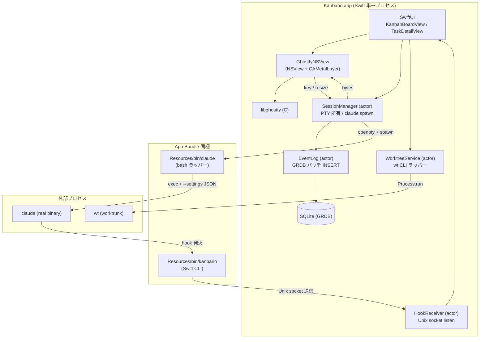
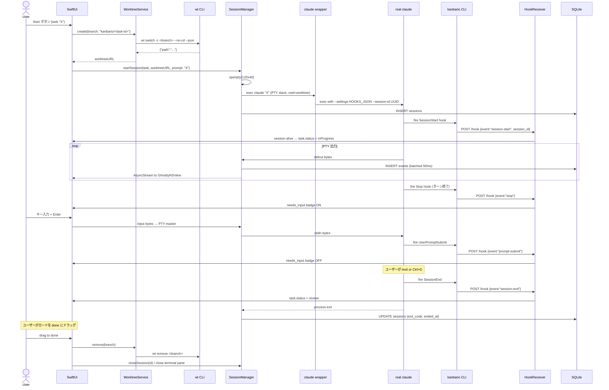
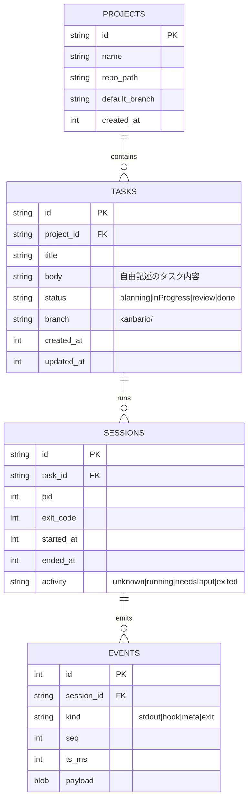

# kanbario 仕様書

> libghostty を実行端末として使い、cmux / Sessylph 的なネイティブ macOS ターミナル体験と Vibe Kanban 的な task orchestration を組み合わせた **AI エージェント管制アプリ**。MVP は Claude Code 専用、Swift 単一言語で構築。

---

## 1. プロダクトの目的と MVP スコープ

### 1.1. プロダクトの目的

- Claude Code エージェントを **カンバンボードから起動・監視・レビュー**する
- `1 card = 1 worktree = 1 claude セッション = 1 terminal` を最小単位とする
- terminal はネイティブレンダリング (libghostty) で GPU 描画・IME・色・リサイズ対応
- **Swift 単一言語** で構築。外部 CLI (`wt`, `claude` 本体) には subprocess で委譲、他言語は増やさない

### 1.2. MVP スコープ (厳密)

#### UI
- 4 列のカンバンボード: **planning / inProgress / review / done**
- Task 追加フォーム (タスク内容を自由記述。追加直後は `planning`)
- Task カードクリック → 詳細画面 (メタデータ + 稼働中の terminal を埋め込み表示)

#### Task ライフサイクル
```
[Create] ─→ planning ─(Start)→ inProgress ─(Claude exit)→ review ─(Move)→ done
                                                                             └→ cleanup (worktree 削除 + terminal 閉じる)
```

#### Start ボタン押下時の挙動
1. `wt switch -c <branch>` で worktree 作成
2. 新しい PTY を開き `claude "<task 内容>"` を spawn (タスク内容を初回プロンプトとして渡す)
3. Claude の hook が Swift app に「running」を通知 → カードが `inProgress` へ移動
4. 詳細画面で libghostty 描画の terminal が表示され、ユーザーは直接キー入力で対話可能

#### 状態遷移のトリガ
- `planning → inProgress`: Start ボタン押下
- `inProgress → review`: Claude プロセスが exit (hook: `SessionEnd`)
- `review → done`: ユーザー手動で drag (done に落としたタイミングで cleanup 実行)
- `done → cleanup`: worktree 削除 + terminal pane 閉じる (claude は既に exit 済み)

### 1.3. MVP の非スコープ
- 複数プロジェクト切替 UI (ローカル 1 リポジトリ想定)
- diff viewer / preview browser
- MCP 統合
- 通知 (bell / UNUserNotification)
- multi-agent 編成
- tmux 統合 / 再起動後の live re-attach (Phase 2)
- Claude 以外のエージェント (Codex / Gemini は後)
- 遠隔 SSH 実行

---

## 2. 技術スタック

| 層 | 選定 | 根拠 |
|---|---|---|
| プラットフォーム | macOS ネイティブ (単一プロセス) | libghostty の GPU 描画フル活用 |
| UI シェル | Swift + AppKit + SwiftUI hybrid | cmux / Sessylph 同方式 |
| Terminal エンジン | **libghostty** (C API) | Bridging Header 経由 |
| PTY / プロセス管理 | `openpty()` + `Foundation.Process` | macOS 標準、追加依存なし |
| worktree 管理 | **worktrunk (`wt` CLI)** を subprocess で呼ぶ | UNIX 哲学、専用ツール活用 |
| DB | **GRDB.swift** (SQLite) | Swift から直接読み書き |
| Hook 受信 CLI | **Swift の 2 つ目の Xcode target** | 言語統一、Codable 型を main app と共有 |
| IPC | Unix domain socket (片方向、hook 通知のみ) | 軽量、~50 行で実装可 |
| 永続化先 | `~/Library/Application Support/kanbario/` | macOS 慣例 |

### 設計上の重要判断

- **App Sandbox は常に OFF** (`ENABLE_APP_SANDBOX = NO`): kanbario は外部プロセス (`claude`, `wt`, `git`, bash) の spawn と任意ディレクトリへのアクセスが必須なので、App Sandbox とは本質的に両立しない。副作用として Mac App Store 配布は不可、Developer ID + notarization での直接配布のみ
- **Swift 単一言語**: main app も CLI も Swift。Xcode プロジェクトに 2 つ target を持つ (macOS App + Command Line Tool)。Go や Rust は使わない
- **worktree は委譲、agent spawn は自前**: `wt` に worktree 作成を任せ、claude の spawn と PTY 管理は kanbario が直接行う (`wt -x` フラグは使わない)
- **Claude hook による状態追跡**: `--settings` で JSON 注入し、`Stop` / `SessionEnd` / `UserPromptSubmit` / `PreToolUse` を受けて UI 状態を更新 (cmux 方式)
- **PTY は kanbario が所有**: raw bytes を SQLite の event log に流し、libghostty に turns. replay と詳細画面での terminal 表示を両立
- **片方向 IPC のみ**: Swift app が Unix socket を listen、CLI 側から一方通行で hook イベントを送る (Rust daemon を持たない軽量構成)

---

## 3. アーキテクチャ図解

### 3.1. 全体像



### 3.2. プロセス構造

```
╔══════════════════════════════════════════════════════════════╗
║  Kanbario.app (Swift メインプロセス)                          ║
║  ──────────────────────────────────────────────────────────  ║
║  UI / libghostty / SessionManager / WorktreeService /        ║
║  HookReceiver (Unix socket listener) / EventLog / GRDB       ║
╚══════════════════════════════════════════════════════════════╝
        │                                       ▲
        │ spawn                                  │ Unix socket
        ▼                                       │
   ┌─────────┐       ┌──────────┐     ┌────────────────┐
   │  wt     │       │  claude  │ ──→ │ kanbario CLI   │
   │ (短命)  │       │  (長命、 │     │ (Swift target) │
   └─────────┘       │  PTY 接続)│     │ ~50行、short-lived│
                     └──────────┘     └────────────────┘
                          ↑ claude は shim ラッパー経由で
                            --settings JSON が注入されている
```

### 3.3. Start → inProgress → review の流れ



### 3.4. データモデル



- `tasks.status` は UI のカラムを決める (4 値)
- `sessions.activity` は Claude の実行状態 (hook で更新、UI の badge 用)
- `events.kind` の `hook` は Claude hook イベント、`stdout` は PTY バイト

---

## 4. モノレポ構成

cmux 流の**フラット Sources/ + 必要に応じてサブディレクトリ**。

```
kanbario/
├── README.md
├── .gitignore
├── Kanbario.xcodeproj/           # メイン Xcode プロジェクト
├── Sources/                       # メインアプリ (macOS App target)
│   ├── KanbarioApp.swift
│   ├── AppDelegate.swift
│   ├── KanbanBoardView.swift     # SwiftUI
│   ├── TaskDetailView.swift      # SwiftUI
│   ├── TaskCardView.swift        # SwiftUI
│   ├── NewTaskSheet.swift        # SwiftUI
│   ├── GhosttyNSView.swift
│   ├── GhosttySurface.swift
│   ├── GhosttyConfig.swift
│   ├── SessionManager.swift      # actor
│   ├── PTY.swift                 # openpty C ラッパー
│   ├── WorktreeService.swift     # actor
│   ├── HookReceiver.swift        # actor (Unix socket listener)
│   ├── ClaudeWrapperInstaller.swift  # Resources/bin/claude を配置
│   ├── Database.swift            # GRDB
│   ├── Models.swift              # Task / Session / Event Codable
│   ├── EventLog.swift            # actor
│   └── AppState.swift            # Observable root state
├── CLI/                           # kanbario CLI (Command Line Tool target)
│   └── main.swift                # ~50 行、hook 送信専用
├── Resources/
│   └── bin/
│       └── claude                # 同梱する bash wrapper
├── Bridging/
│   └── Kanbario-Bridging-Header.h
├── vendor/
│   └── libghostty/               # prebuilt (.gitignore、scripts で取得)
├── scripts/
│   ├── fetch-libghostty.sh
│   └── bootstrap.sh              # brew install worktrunk 案内
├── kanbario.entitlements
├── KanbarioTests/
└── docs/
    └── spec.md                   # 本ファイル
```

**Xcode target 2 つ**:
1. **Kanbario** (macOS App): UI + SessionManager + libghostty 全部
2. **kanbario** (macOS Command Line Tool): hook 受信用。Build Phase で App target にバンドル

---

## 5. Swift アプリ設計

### 5.1. ウィンドウ構成

```
NSWindow (単一、タブ可能)
└── NSSplitViewController (horizontal)
    ├── Sidebar         → SwiftUI KanbanBoardView (4 列)
    └── DetailArea      → SwiftUI TaskDetailView
        ├── 上: Task メタデータ (title, body, branch, status badge)
        └── 下: NSViewRepresentable(GhosttyNSView)  ← 選択中 task の terminal
```

### 5.2. KanbanBoardView (SwiftUI)

4 列レイアウト:

```swift
struct KanbanBoardView: View {
    @Observable var store: TaskStore

    var body: some View {
        HStack(alignment: .top, spacing: 12) {
            ForEach(TaskStatus.allCases, id: \.self) { status in
                KanbanColumn(title: status.displayName,
                             tasks: store.tasks(in: status),
                             onDrop: { task in
                                 await store.move(task, to: status)
                             })
            }
        }
    }
}

enum TaskStatus: String, CaseIterable, Codable {
    case planning, inProgress, review, done
}
```

`.dropDestination(for: Task.self)` で drag-and-drop を実装。`store.move` は状態遷移ルールを enforce (無効な遷移は reject)。

### 5.3. SessionManager (actor)

PTY + claude wrapper spawn + event log。

```swift
actor SessionManager {
    private var sessions: [SessionID: Session] = [:]
    private let db: Database
    private let eventLog: EventLog
    private let socketPath: URL  // HookReceiver の socket path

    func start(task: Task, worktreeURL: URL) async throws -> Session {
        let (masterFD, slaveFD) = try PTY.openpty(cols: 120, rows: 40)

        let process = Process()
        process.executableURL = Bundle.main.url(forResource: "bin/claude", withExtension: nil)
        process.arguments = [task.body]  // 初回プロンプト = task 内容
        process.currentDirectoryURL = worktreeURL
        process.environment = [
            "KANBARIO_SURFACE_ID": task.id.uuidString,
            "KANBARIO_SESSION_ID": SessionID.new().uuidString,
            "KANBARIO_SOCKET_PATH": socketPath.path,
            "KANBARIO_HOOK_CLI_PATH": Bundle.main.url(forResource: "bin/kanbario", withExtension: nil)!.path,
        ]
        process.standardInput  = FileHandle(fileDescriptor: slaveFD, closeOnDealloc: false)
        process.standardOutput = FileHandle(fileDescriptor: slaveFD, closeOnDealloc: false)
        process.standardError  = FileHandle(fileDescriptor: slaveFD, closeOnDealloc: false)

        try process.run()
        close(slaveFD)

        let session = Session(id: .new(), taskID: task.id,
                              pid: process.processIdentifier, masterFD: masterFD)
        sessions[session.id] = session
        try await db.insertSession(session)

        Task.detached { [weak self] in
            await self?.readLoop(session: session)
        }
        return session
    }

    private func readLoop(session: Session) async {
        let handle = FileHandle(fileDescriptor: session.masterFD, closeOnDealloc: true)
        var seq: UInt64 = 0
        for await chunk in handle.bytes.chunked(size: 4096) {
            seq += 1
            await eventLog.enqueue(.stdout(sessionID: session.id, seq: seq, data: chunk))
            await session.broadcast(chunk)  // GhosttyNSView 等の購読者へ
        }
    }
}
```

### 5.4. WorktreeService (actor)

`wt` CLI を subprocess で呼ぶ薄いラッパー。

**重要**: `wt switch` には JSON 出力オプションが無い (検証済み、worktrunk 0.34.1)。一方 `wt list --format=json` は対応している。よって **2 段階呼び出し** を行う:

1. `wt switch -c <branch> --no-cd` で worktree を作成 (JSON 出力なし)
2. `wt list --format=json` で全 worktree を取得 → branch 名でフィルタしてパスを取得

```swift
actor WorktreeService {
    struct Worktree: Codable {
        let path: String
        let branch: String
        let isCurrent: Bool?

        enum CodingKeys: String, CodingKey {
            case path, branch
            case isCurrent = "is_current"
        }
    }

    func create(branch: String) async throws -> URL {
        _ = try await runWT(["switch", "-c", branch, "--no-cd"])
        let all = try await list()
        guard let found = all.first(where: { $0.branch == branch }) else {
            throw Error.worktreeNotFound(branch)
        }
        return URL(fileURLWithPath: found.path)
    }

    func list() async throws -> [Worktree] {
        let output = try await runWT(["list", "--format=json"])
        return try JSONDecoder().decode([Worktree].self, from: output)
    }

    func remove(branch: String) async throws {
        _ = try await runWT(["remove", branch])
    }

    private func runWT(_ args: [String]) async throws -> Data { /* Process 実行 */ }
}
```

**`wt` コマンドは shell function ラップ**: ユーザーの `.zshrc` に `wt ()` が定義されていて、本体は `WORKTRUNK_BIN` env or `wt` 実体を呼ぶ。Swift 側から Process で直接呼ぶ場合は **関数を経由しない** ので副作用 (cd など) は発生しない。我々は `--no-cd` を明示し、パスは `list` から引く設計にしているので問題なし。

### 5.5. HookReceiver (actor)

`Network.framework` の `NWListener` で Unix socket を listen。

```swift
actor HookReceiver {
    struct HookEvent: Codable {
        let event: String      // "session-start" | "stop" | "session-end" | ...
        let sessionId: String
        let surfaceId: String
        let payload: Data?
    }

    func start(socketPath: URL, onEvent: @escaping (HookEvent) async -> Void) throws {
        let params = NWParameters.tcp  // 実際は NWProtocolFramer で Unix socket
        let listener = try NWListener(using: params, on: .unix(path: socketPath.path))
        listener.newConnectionHandler = { connection in
            connection.start(queue: .global())
            self.receive(on: connection, onEvent: onEvent)
        }
        listener.start(queue: .global())
    }
}
```

受信した event は AppState (Observable) に反映:
- `session-start` → `tasks.status = inProgress`, `sessions.activity = running`
- `stop` → `sessions.activity = needsInput`
- `prompt-submit` → `sessions.activity = running`
- `session-end` → `tasks.status = review`, `sessions.activity = exited`

### 5.6. EventLog (actor)

PTY 生バイトと hook イベントを 50ms ウィンドウでバッチ INSERT。

```swift
actor EventLog {
    private var buffer: [Event] = []
    private var flushTask: Task<Void, Never>?
    private let db: Database

    func enqueue(_ event: Event) {
        buffer.append(event)
        if flushTask == nil {
            flushTask = Task {
                try? await Task.sleep(for: .milliseconds(50))
                await flush()
            }
        }
    }

    private func flush() async {
        let batch = buffer; buffer.removeAll(keepingCapacity: true); flushTask = nil
        try? await db.writeBatch(batch)
    }
}
```

GRDB 初期化時に `journal_mode=WAL` + `synchronous=NORMAL`。

---

## 6. Claude Code 統合

### 6.1. Claude ラッパー (`Resources/bin/claude`)

cmux 方式を踏襲した bash スクリプト。App Bundle 内 `Contents/Resources/bin/claude` に配置。

```bash
#!/usr/bin/env bash
# kanbario claude wrapper — hook 注入付きで real claude を起動
#
# KANBARIO_SURFACE_ID が設定されていれば、kanbario の中で動いていると判定し、
# --settings で hooks JSON を注入する。

find_real_claude() {
    local self_dir="$(cd "$(dirname "$0")" && pwd)"
    local IFS=:
    for d in $PATH; do
        [[ "$d" == "$self_dir" ]] && continue
        [[ -x "$d/claude" ]] && printf '%s' "$d/claude" && return 0
    done
    return 1
}

if [[ -z "$KANBARIO_SURFACE_ID" ]]; then
    REAL_CLAUDE="$(find_real_claude)" || { echo "claude not found" >&2; exit 127; }
    exec "$REAL_CLAUDE" "$@"
fi

HOOK_CLI="${KANBARIO_HOOK_CLI_PATH:-kanbario}"
HOOKS_JSON="$(cat <<EOF
{
  "hooks": {
    "SessionStart": [{"hooks":[{"type":"command","command":"\"$HOOK_CLI\" claude-hook session-start","timeout":10}]}],
    "Stop":         [{"hooks":[{"type":"command","command":"\"$HOOK_CLI\" claude-hook stop","timeout":10}]}],
    "SessionEnd":   [{"hooks":[{"type":"command","command":"\"$HOOK_CLI\" claude-hook session-end","timeout":5}]}],
    "UserPromptSubmit":[{"hooks":[{"type":"command","command":"\"$HOOK_CLI\" claude-hook prompt-submit","timeout":10}]}],
    "PreToolUse":   [{"hooks":[{"type":"command","command":"\"$HOOK_CLI\" claude-hook pre-tool-use","timeout":5,"async":true}]}]
  }
}
EOF
)"

REAL_CLAUDE="$(find_real_claude)" || { echo "claude not found" >&2; exit 127; }
exec "$REAL_CLAUDE" --settings "$HOOKS_JSON" "$@"
```

**重要ポイント**:
- `KANBARIO_SURFACE_ID` 未設定 = kanbario 外 → pass-through (副作用ゼロ)
- `$@` の末尾に task 内容 (`claude "task body"`) が渡されるので、hook 注入しつつ初回プロンプトは活きる
- `Resources/bin/kanbario` のパスは環境変数で渡す (bundle 位置が実行時に決まるため)

### 6.2. kanbario CLI (`CLI/main.swift`)

Hook 受信用の軽量 Swift binary。

```swift
import Foundation

// 引数: "claude-hook <event>"
guard CommandLine.arguments.count >= 3,
      CommandLine.arguments[1] == "claude-hook" else {
    exit(1)
}
let event = CommandLine.arguments[2]

let socketPath = ProcessInfo.processInfo.environment["KANBARIO_SOCKET_PATH"] ?? ""
let surfaceID  = ProcessInfo.processInfo.environment["KANBARIO_SURFACE_ID"] ?? ""
let sessionID  = ProcessInfo.processInfo.environment["KANBARIO_SESSION_ID"] ?? ""

// stdin から hook の JSON 本体を読む (Claude Code が渡すメタデータ)
let stdinData = FileHandle.standardInput.readDataToEndOfFile()

struct HookMessage: Codable {
    let event: String
    let surfaceID: String
    let sessionID: String
    let payload: Data
}

let msg = HookMessage(event: event, surfaceID: surfaceID, sessionID: sessionID, payload: stdinData)
let jsonData = try JSONEncoder().encode(msg)

// Unix socket に接続して 1 行 JSON を送る
let socket = socket(AF_UNIX, SOCK_STREAM, 0)
var addr = sockaddr_un()
addr.sun_family = sa_family_t(AF_UNIX)
_ = socketPath.withCString { cstr in
    withUnsafeMutableBytes(of: &addr.sun_path) { buf in
        strncpy(buf.baseAddress?.assumingMemoryBound(to: CChar.self), cstr, buf.count - 1)
    }
}
// ...connect, write, close (省略)
exit(0)
```

**Codable 型 `HookMessage` を main app と共有**するため、Shared module を Xcode で設定すると一元管理できる。

### 6.3. 状態遷移ルール (確定版、2026-04-20 改訂)

**Kanban カラムの意味論** (重要):

- `inProgress` = claude が**能動的に作業中** (tool 実行 / reasoning)
- `review` = claude のターンが終わって**ユーザー入力待ち** (cmux における "needsInput") もしくは claude プロセス exit 後の停止状態
- `done` = ユーザーが完了とした (手動 drag、cleanup 発火)

つまり 1 つのタスクは hook が来るたびに `inProgress ↔ review` を行き来する
(ユーザーが claude にメッセージを送れば inProgress、claude のターンが終われば
review)。`canTransition` は両方向を許可済み。

| Hook event | tasks.status | activitiesByTaskID |
|---|---|---|
| `SessionStart` | `inProgress` (planning なら前進、それ以外は idempotent) | `running` |
| `UserPromptSubmit` | `inProgress` (review からの再開を含む) | `running` |
| `PreToolUse` (async) | `inProgress` (idempotent) | `running` |
| `Stop` | `review` (inProgress → review、それ以外は触らない) | `needsInput` |
| `SessionEnd` | `review` (close_surface_cb 経路と冗長、idempotent) | (削除) |
| `Notification` | (no-op) | (no-op) |

`activitiesByTaskID` は `inProgress` カラム内で「claude が今何をしているか」
の細粒度バッジに使う想定 (running の中で reasoning か tool 実行か等)。
status とほぼ冗長になるが、UI で細かい表示が必要になった時の保険として保持。

`review → done` はユーザーの drag で発火、cleanup は UI 側で:
```swift
func moveToDone(task: Task) async {
    await sessionManager.killIfAlive(taskID: task.id)  // 念のため
    await worktreeService.remove(branch: task.branch)
    try? await db.updateStatus(task.id, .done)
}
```

---

## 7. libghostty 埋め込み

### 7.1. ベンダリング

`scripts/fetch-libghostty.sh` が commit SHA 固定で libghostty をビルド (Ghostty リポジトリから `zig build`)。参照: Sessylph の公開ビルドガイド + Ghostling。

配置:
```
vendor/libghostty/
├── include/ghostty.h
└── lib/libghostty.a
```

Xcode の `HEADER_SEARCH_PATHS` と `LIBRARY_SEARCH_PATHS` で参照。

### 7.2. Bridging Header

```c
// Bridging/Kanbario-Bridging-Header.h
#include "ghostty.h"
```

### 7.3. GhosttySurface

```swift
final class GhosttySurface {
    private var app: OpaquePointer?
    private var surface: OpaquePointer?

    init(metalLayer: CAMetalLayer) throws {
        // ghostty_init() → ghostty_config_new() → ghostty_app_new() → ghostty_surface_new(metalLayer)
    }

    func write(_ bytes: Data) {
        bytes.withUnsafeBytes { ptr in
            ghostty_surface_write(surface, ptr.baseAddress, bytes.count)
        }
    }
    func setSize(cols: Int, rows: Int) {
        ghostty_surface_set_size(surface, UInt32(cols), UInt32(rows))
    }
    func encodeKey(_ event: NSEvent) -> Data? { /* libghostty input encode */ }
}
```

### 7.4. データフロー

```
claude (PTY slave)
  → PTY master (SessionManager)
  → EventLog (GRDB INSERT, 50ms バッチ)
  → AsyncStream<Data> broadcast
  → GhosttyNSView → ghostty_surface_write
  → libghostty Metal 描画
```

キー入力は逆順。

---

## 8. Phase 1 マイルストーン (約 10-14 日)

### Milestone A — "Swift + wt + bash が回る" (Day 1-3)
- Xcode プロジェクト (App target + CLI target)
- AppKit シェル + NSSplitViewController
- `openpty()` C FFI ラッパー
- `SessionManager` で `/bin/bash` を spawn → stdout を console に print
- `WorktreeService.create()` で `wt switch -c test --no-cd --json` を実行
- GRDB で projects / tasks / sessions / events テーブル作成
- **完了条件**: Xcode からアプリ起動 → テスト起動メソッドで worktree 作成 + bash 起動 + events に PTY バイト INSERT

### Milestone B — "Kanban UI + 手動 Move" (Day 4-6)
- SwiftUI `KanbanBoardView` 4 列
- `NewTaskSheet` でタスク追加 (title + body, 初期 status = planning)
- drag-and-drop で status 変更 (model 側で遷移ルール enforce)
- `TaskDetailView` の上半分 (メタデータ)
- **完了条件**: タスクを UI から追加・drag で移動できる。DB に永続化される

### Milestone C — "claude 起動 + hook 統合" (Day 7-10)
- `Resources/bin/claude` shim スクリプト作成
- `CLI/main.swift` で hook 送信 CLI 実装
- `HookReceiver` で Unix socket listener
- Start ボタン → `wt switch -c` → shim 経由で `claude "<task.body>"` spawn
- hook イベントを受けて `tasks.status` を自動遷移 (planning → inProgress → review)
- Terminal ペインは一旦 `NSTextView` でバイト追記 (VT 解釈なし)
- done に drag すると `wt remove <branch>` + セッション終了
- **完了条件**: Start 押下 → worktree 作成 → claude 起動 → inProgress 表示 → Claude /exit → 自動で review → done に drag → 全部 cleanup

### Milestone D — "libghostty 描画" (Day 11-14)
- `scripts/fetch-libghostty.sh` で libghostty を取得
- `GhosttyNSView` 実装、`NSTextView` と差し替え
- 色・カーソル・リサイズが正常動作
- 詳細画面で現在稼働中の claude セッションが正しく見える
- **完了条件**: claude セッションが色つきで描画される。タスク詳細を開くと生きている terminal が見える

---

## 9. リスクと緩和策

| リスク | 緩和策 |
|---|---|
| **libghostty API 不安定** | SHA 固定、C 呼び出しを `Sources/Ghostty*.swift` に隔離 |
| **worktrunk が `--json` 出力を持たない** | 事前検証、なければ `git worktree list --porcelain` 併用 or 人間可読パース |
| **worktrunk メンテ停止** | 脱出パス: `git worktree add/remove` を直接 Swift から呼ぶ (~30 行で代替可) |
| **Claude Code の hook 仕様変更** | hook 名・JSON 形式は Claude Code の公開仕様に従う。変わったら `claude.bash` を更新 |
| **PTY 再 attach 不可** (MVP の既知制約) | done 以外の状態でアプリ ⌘Q 時は「claude は生きているが表示できない」を明示 UI で示す。Phase 2 で tmux 統合検討 |
| **`claude` が PATH にない** | 設定で path 指定 + 自動検出 (`which claude`)。shim は `find_real_claude` で PATH を掃討 |
| **macOS 署名 / notarization** | MVP は ad-hoc (`codesign --sign -`)、shim は `+x` のみ必要 |
| **GRDB 書き込み負荷** | WAL + 50ms バッチ、測定してから追加最適化 |

---

## 10. 参照プロジェクト

- **cmux** https://github.com/manaflow-ai/cmux — Swift + AppKit + libghostty + Claude hook 統合の先行実装。**最重要参照**。`Resources/bin/claude` の設計を踏襲
- **Sessylph** (https://zenn.dev/saqoosha/articles/sessylph-libghostty-claude-code-terminal) — libghostty + Claude Code のネイティブターミナル実例、ビルド手順
- **Vibe Kanban** https://github.com/BloopAI/vibe-kanban — データモデル設計 (Task / Session / Attempt) の参照。コードは Rust なので概念移植のみ
- **worktrunk** https://github.com/max-sixty/worktrunk — worktree 管理 CLI、依存として利用
- **Ghostling** https://github.com/ghostty-org/ghostling — libghostty 最小 init サンプル

---

## 11. Phase 2 以降 (スコープ外、参考)

- 複数プロジェクト切替
- diff viewer (SwiftUI or CodeMirror)
- preview browser (WKWebView)
- MCP integration (Swift MCP SDK)
- `UNUserNotificationCenter` 通知
- **tmux 統合** — live re-attach 対応
- multi-agent (Codex / Gemini / カスタム)
- Claude 以外のエージェント用 hook ラッパー

---

## 12. 検証方法

### Milestone A
```bash
open Kanbario.xcodeproj
# Xcode からアプリ起動 → テストボタンで bash 起動
sqlite3 ~/Library/Application\ Support/kanbario/kanbario.db \
  "SELECT session_id, kind, seq, length(payload) FROM events LIMIT 20;"
ls ~/path/to/repo.test/  # worktree 確認
```

### Milestone B
- UI 上でタスク追加 → drag で全 4 列間を移動できる
- アプリ再起動後、タスクの永続化を確認

### Milestone C
- タスクを planning で作成 → Start → console で claude 起動確認
- `ps -ef | grep claude` で claude プロセス生存確認
- Claude で適当に対話 → `/exit` → UI が自動で review に移動
- review → done に drag → `wt list` に worktree がないこと、`ps -ef | grep claude` に claude がないことを確認

### Milestone D
- Start → 詳細画面に色つき terminal 表示、カーソル移動・リサイズ動作
- 2 つのタスクを同時に Start → 切替で各 terminal が正しく表示される

---

## Appendix: 確定した設計判断

1. **worktree 命名**: `kanbario/<task-id>` (ULID) を採用。task title からの slug 化はしない (特殊文字対応が面倒)
2. **claude が見つからない時の UX**: Settings で path 指定可能。MVP では `which claude` でのみ検出、見つからなければエラーダイアログ
3. **Event log のリテンション**: MVP では削除しない。Phase 2 で「done 後 30 日で events を vacuum」を追加
4. **done 時の worktree cleanup 方針**: ユーザーが done に drag したタイミングで `wt remove` を自動実行。失敗時はダイアログで確認 (dirty tree の可能性)
5. **detached spawn 時の ⌘Q 挙動**: MVP では子プロセスを生かす (`setpgid`)。UI で「生きているが再 attach 不可」を明示

## Appendix: MVP 後の検討事項

- CLI の Go 化 (hook 起動レイテンシが体感に響くようなら)
- XcodeGen 導入 (メンテ複数人体制になったら)
- tmux 統合 (live re-attach が欲しくなったら)
- review → inProgress 戻し (ユーザーが「もう少しやらせる」判断用)
